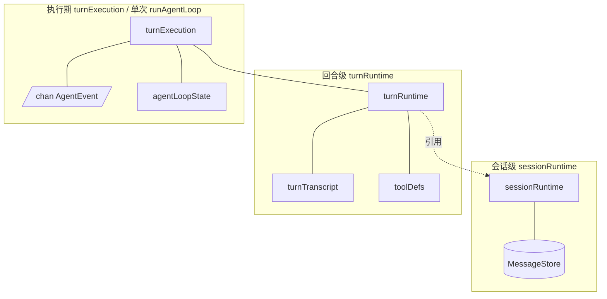
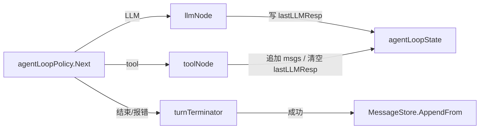

# `internal/agent`

本包实现「用户一轮输入 → LLM ↔ 工具内层循环 → 结束」的编排，依赖 `llm`、`tools`、`builtin` 等，对外入口为 **`Agent.RunTurn`**。

## 架构图

### 静态结构（组合关系）

### 内层循环（动态）

## 分层结构（由长到短）

| 层级 | 含义 | 主要类型 |
|------|------|----------|
| **会话** | Agent 生命周期内共享：存储、模型、工具、系统提示 | `sessionRuntime`（`session_runtime.go`） |
| **回合** | 单次用户输入：可变消息列表 + 工具定义 | `turnRuntime`（`turn_runtime.go`） |
| **执行期** | 一次 `runAgentLoop`：事件出口 + 内层循环状态 | `turnExecution`（`turn_execution.go`） |
| **内层循环** | Hub 决策与 LLM/tool 接力 | `agentLoopState`（`agent_loop_state.go`）、`agentLoopPolicy`（`agent_loop_policy.go`） |

## 文件一览

| 文件 | 作用 |
|------|------|
| `agent.go` | `Agent` 构造与 `RunTurn` / `runTurn`（含内置命令前缀） |
| `agent_loop.go` | `runAgentLoop` 主循环；`turnTerminator` 处理成功落库与错误事件 |
| `session_runtime.go` | 会话级运行时（`MessageStore`、LLM 客户端、模型、工具注册表、系统提示） |
| `turn_runtime.go` | 单用户回合：基于 `RequestMessages` 创建 `turnTranscript` 与 `toolDefs` |
| `turn_transcript.go` | 本轮发往 LLM 的 `msgs` 及 `AppendFrom` 用的 `commitFrom` |
| `turn_execution.go` | `turnExecution`：组合 `turnRuntime`、`out`、`agentLoopState` |
| `agent_loop_state.go` | 内层循环状态：`lastLLMResp`、LLM 调用次数与上限 |
| `agent_loop_policy.go` | 根据状态决定下一步（LLM / tool / 结束 / 报错） |
| `node_llm.go` | LLM 节点：调用 `Generate` 并写回 `lastLLMResp` |
| `node_tool.go` | 工具节点：执行 tool_calls、写回 transcript、发 Tool 事件 |
| `message_store.go` | 多轮消息持久化、`RequestMessages`、`AppendFrom`、`RecordToolInvocation`（内置命令用） |
| `message_builder.go` | 构造 `llm.Message` 片段（system/user、tool 协议等） |
| `events.go` | `AgentEvent` 与事件类型 |
| `builtin_bridge.go` | 内置命令输出到 `AgentEvent` 的映射 |

## 数据流（极简）

1. `MessageStore.RequestMessages` + 用户输入 → 初始 **`turnTranscript`**。  
2. **`agentLoopPolicy`** 决定下一步 → **`llmNode`** 或 **`toolNode`**。  
3. 成功以文本结束时 **`turnTerminator`**：`AppendFrom` 将本轮 transcript 后缀并入 `MessageStore`。
